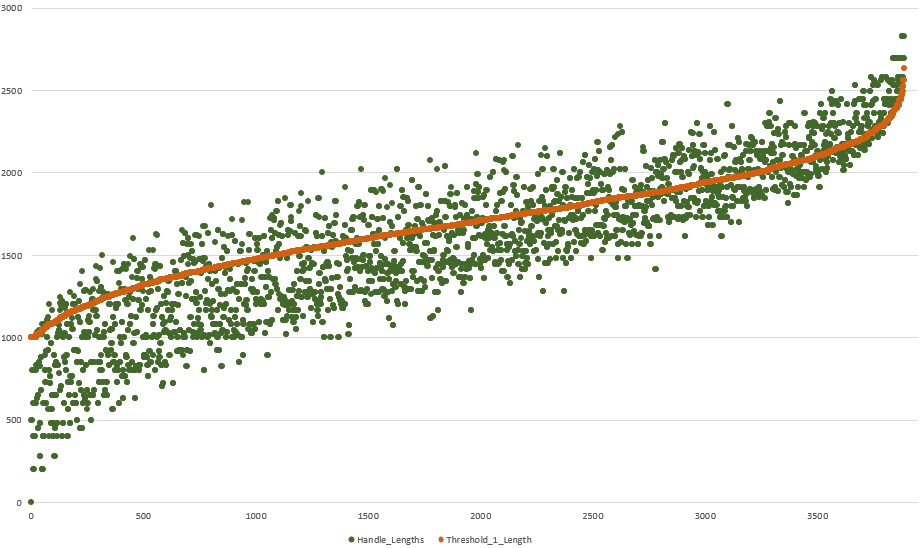

# Bezier Curve Length
Bezier curves, mainly of the Cubic variety, are used extensively in graphics and design programs, 
like SVG and Opentype fonts.  There are some mathematically complete ways to calculate the length 
of a given Bezier curve, but they involve complex calculus, and don't always yield results easily. 

The current non-calculus method for finding the length of a Bezier curve is to recursively break 
it down into pieces, until a curve is small enough such that it can be approximated by a straight 
line.  This method is time and compute intensive.

This project aims to brute-force calculate and test a bunch of 'quick' methods for calculating 
the length of a Bezier curve.  We can find out how far off each 'quick' method is by also calculating 
and comparing the results against the recursive result.  Hopefully we can find something that is 
*close enough*.

# Accuracy Result
After trying many simple geometric functions, based on the 4 points of a Bezier curve, none of them 
resulted in very accurate results (as expected).  The closest one was actually just adding up the 
distance between P1/P2 and P3/P4.  Here is a graph.  Orange is the current best slicing method, and 
green is the simple adding lengths method.  There is at least a correlation here (which wasn't true 
for the other methods I tried).  It's more accurate at longer path lengths (right side of the graph).

## License
 Copyright (C) 2018 Matthew LaGrandeur, released under
 [GPL 3.0](https://www.gnu.org/licenses/gpl-3.0.html)

## Author
|  |
|---|
| [Matthew LaGrandeur](http://mattlag.com/) |
| matt[at]mattlag[dot]com |